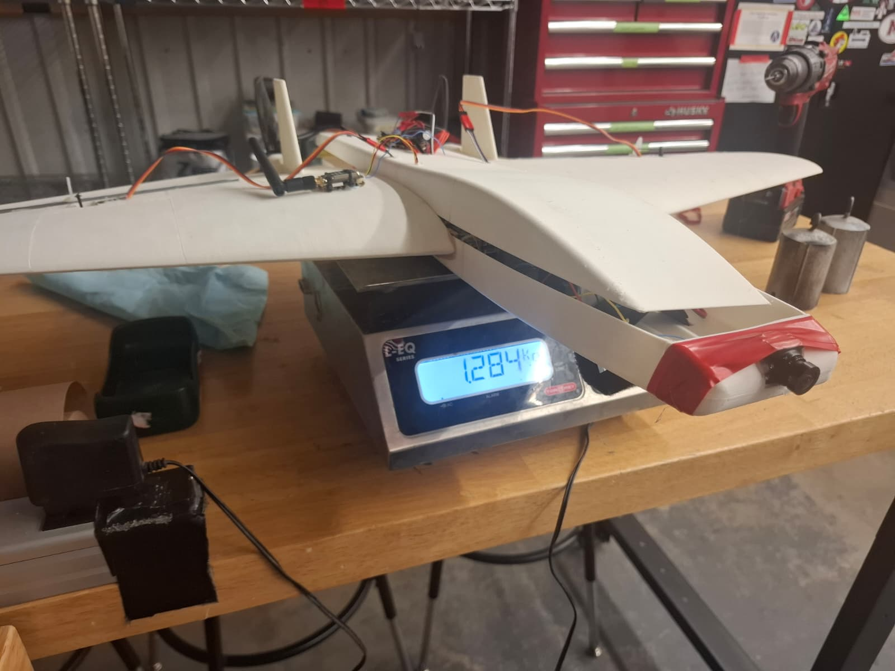
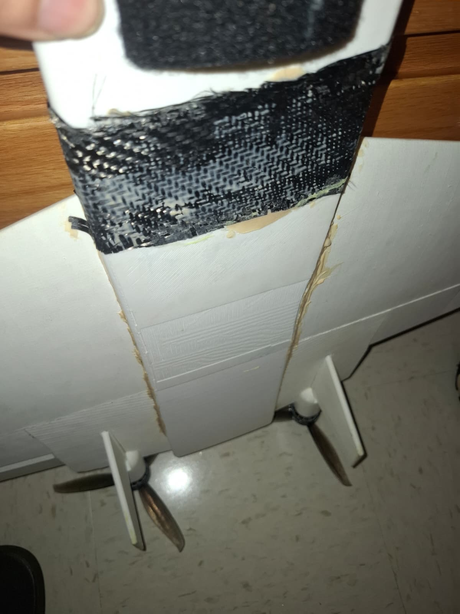

# AWRAS 1.2

**Built at UMass. Two launch attempts, no flight yet — catapult next.**

  

---

## What this is

Same aircraft as [1.1](https://github.com/morakah-hub/AWRAS-1.1), reprinted here after the Qatar airframe stayed behind. The electronics came back with me and went straight into this one.

Design and analysis are in [1.0](https://github.com/morakah-hub/AWRAS-1.0).

---

## What changed from 1.1

- **Lower fuselage half printed in PLA Pro** instead of LW-PLA, for stiffness where the airframe takes the most abuse on belly landings. Wings and upper fuselage stay LW-PLA.
- **JB Weld** on the structural joints instead of epoxy, with weights holding alignment while it cures.

  

  

  

---

## As built

| Item | Value |
| --- | --- |
| All-up weight | 1,284 g (1.0 design estimate: ~1,200 g) |
| Propellers | 7in |
| Launch method | Hand launch (attempts 1–2) |

  

---

## Ground testing

Hand-held throttle test with both motors running, airframe assembled and wired. Control surfaces, failsafe, and range checked before the first attempt.

📹 [Thrust test](images/ThrustTest-Awras.mp4) · [More footage (Google Drive)](https://drive.google.com/drive/folders/1H33g_RjYtuLtiPmjm7w3s-vO929V_Xyw?usp=drive_link)

📹 [Walkaround](images/Awras-clean.mp4)

  

---

## Flight attempts

Both attempts were hand launches. Neither reached flying speed.

| # | Date | Throttle at release | What happened | Damage |
| --- | --- | --- | --- | --- |
| 1 | September 23 | Below full | Didn't reach flying speed after release | Nose broke |
| 2 | September 25 | Full | Still didn't reach flying speed after release | Nose broke |

📹 [Attempt video](images/AWRAS-3rd-Attempt.mp4)

**Diagnosis:** a hand throw doesn't give this aircraft enough speed at release. Attempt 1 was also launched below full throttle. Attempt 2 fixed that and still fell short, so throttle alone isn't the answer. The plane came out 84 g (about 7%) heavier than the 1.0 estimate, which raises the speed it needs to fly by roughly 3–4% and makes the problem slightly worse.

### Nose repair

The nose broke on both attempts. After the first, it was reinforced with carbon fiber and epoxy.

  

---

## Next

- **Launch catapult**, so launch speed is repeatable instead of depending on the throw.
- **Possible motor upgrade** for more thrust, depending on what the thrust numbers show.
- Third attempt next weekend.

---

## Status

- [x] All parts printed
- [x] Airframe glued
- [x] Electronics installed and wired
- [x] Motor run-up
- [x] Ground tests — control surfaces, failsafe, range
- [x] Hand-launch attempts (2) — did not fly
- [x] Nose reinforced with carbon fiber after attempt 1
- [ ] Launch catapult built
- [ ] First flight
